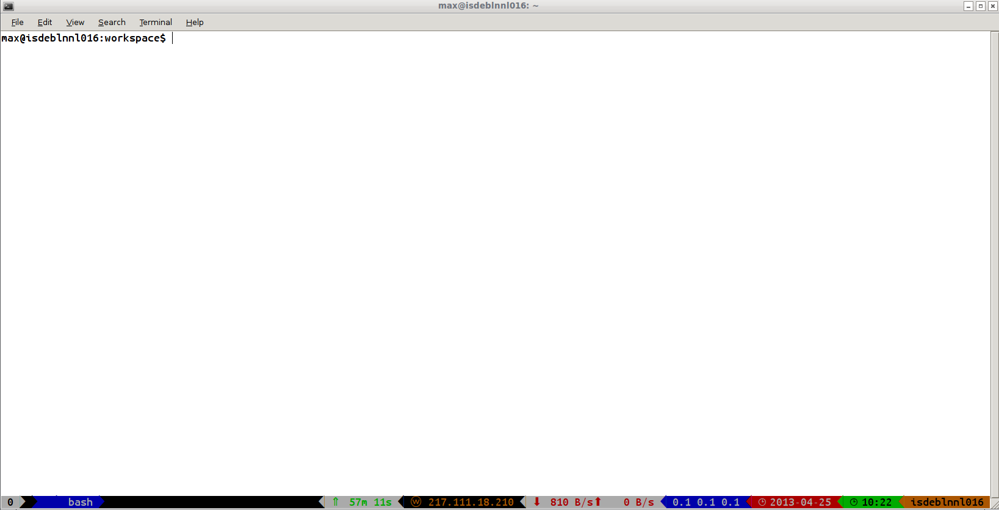

powerline-config
================

Powerline configuration for tmux. Includes the color scheme and segment configuration I use.
  
See the amazing [powerline from Lokaltog](https://github.com/Lokaltog/powerline) for more information.

# Installation
Running ```install.sh``` will symlink the powerline directory to your per-user powerline configuration.
Beware, this will overwrite your configuration, so you might want to back it up first..

# Screenshot

